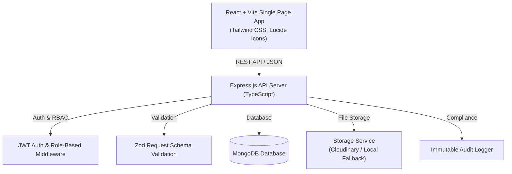

# 🏥 FollowUp (Health Platform)
### *Patient-Controlled Longitudinal Health Records & Consent-Driven Clinical Access Platform*

[](https://www.typescriptlang.org/)
[](https://react.dev/)
[](https://expressjs.com/)
[](https://www.mongodb.com/)
[](https://tailwindcss.com/)
[](https://vitejs.dev/)

---

## 🌟 The Problem
Modern electronic medical record (EMR) systems are fragmented and hospital-centric. When patients visit different clinics, specialists, or emergency rooms:
- Medical history is trapped in disconnected institutional silos or lost on paper.
- Patients lack ownership and visibility over who accesses their sensitive health data.
- Doctors make critical clinical decisions without full context of past allergies, medications, or diagnostic history.
- In medical emergencies, first responders lose precious minutes trying to discover life-critical conditions.

---

## 💡 The Solution: FollowUp
**FollowUp** flips the traditional EMR paradigm by placing **the patient at the center of their healthcare data**. Patients carry a lifetime longitudinal health passport (`PAT-XXXXXX`), while doctors gain permissioned, consent-backed access to provide coordinated, high-quality care.

### 🛡️ Core Pillars:
1. **Patient-Centric Ownership**: Patients own, manage, and view their complete medical timeline, allergies, active medications, and uploaded clinical files.
2. **Granular Consent & Access Control**: Doctors must explicitly request access with a stated clinical reason. Patients can approve, deny, or revoke access at any time.
3. **Emergency "Break-Glass" HUD**: In life-threatening emergencies, first responders can instantly access vital triage data (blood group, anaphylactic allergies, active medications, emergency contacts) with a permanent security audit record.
4. **Interactive Longitudinal Timeline**: Chronological, filterable visualization of a patient's lifetime consultations, prescriptions, checkups, and diagnostic reports.
5. **Physician Care Plans ("Health Paths")**: Doctors formulate structured recovery pathways allowing patients to track milestones, habits, and medications collaboratively.
6. **Immutable Audit Trail**: Every view, document access, consent grant, and emergency lookup is logged with timestamps, actor IDs, and clinical rationales.
7. **Collision-Free Identity Separation**: Strict namespace separation between Patients (`PAT-XXXXXX`) and verified Doctors (`DOC-XXXXXX`) to eliminate authorization vulnerabilities.

---

## 🏗️ Architecture & System Design



---

## 📂 Project Structure

```
├── client/                     # Frontend Application (React + Vite + Tailwind CSS)
│   ├── src/
│   │   ├── components/         # Reusable UI components & modals
│   │   │   ├── common/         # Navbar, Footer (with legal modals), ProtectedRoute, IdentityBadge
│   │   │   ├── doctor/         # Care plan modals, Consultation modals
│   │   │   └── patient/        # Allergy, Condition, Medication, Upload & Access modals
│   │   ├── context/            # AuthContext (JWT session state) & ToastContext
│   │   ├── pages/              # Role-specific dashboard & portal pages
│   │   │   ├── auth/           # Patient & Doctor Login/Register views
│   │   │   ├── doctor/         # Doctor Dashboard, Patient Lookup, Chart View, Health Paths, Emergency
│   │   │   ├── patient/        # Patient Dashboard, Records Vault, Timeline, Care Paths, Privacy Audit
│   │   │   ├── ContactPage.tsx # Reach Out To Us page (Direct helpline, Email, Address, Inquiry form)
│   │   │   ├── EmergencyPage.tsx # Emergency Break-Glass portal
│   │   │   ├── FAQPage.tsx     # Searchable 6 Healthcare FAQs & Accordions
│   │   │   ├── LandingPage.tsx # Homepage with live health card preview & on-page FAQs
│   │   │   └── TeamPage.tsx    # Team members & project builder details
│   │   ├── services/api.ts     # Centralized Axios HTTP client & API handlers
│   │   └── types/              # Frontend TypeScript interfaces
│   └── vite.config.ts          # Vite configuration with API proxy & allowed hosts
│
├── src/                        # Backend Application (Node.js + Express + TypeScript)
│   ├── config/                 # Database connection & Environment configuration
│   ├── controllers/            # Route controllers handling HTTP requests
│   │   ├── accessGrant.controller.ts  # Doctor access request & consent management
│   │   ├── audit.controller.ts        # Audit trail retrieval
│   │   ├── auth.controller.ts         # User registration & authentication
│   │   ├── doctor.controller.ts       # Clinical lookup & consultations
│   │   ├── emergency.controller.ts    # Break-glass emergency snapshot lookup
│   │   ├── healthPath.controller.ts   # Structured care pathways
│   │   ├── patient.controller.ts      # Profile, allergies, medications, conditions
│   │   ├── record.controller.ts       # Medical record upload & document downloads
│   │   └── timeline.controller.ts     # Longitudinal timeline aggregation
│   ├── middleware/             # Auth, role authorization, logging & error handlers
│   ├── models/                 # Mongoose schema models (User, Record, HealthPath, Audit, etc.)
│   ├── routes/                 # Express API route endpoints
│   ├── services/               # Business logic layer
│   ├── utils/                  # ID generators, Multer file uploaders, AppError class
│   └── validators/             # Zod input validation schemas
│
├── tests/                      # Automated End-to-End Test Suite
│   └── master_e2e.test.ts      # Full platform lifecycle E2E test
├── seed-demo.ts                # Comprehensive demo database seeder
└── package.json                # Project dependencies & scripts
```

---

## 🌐 Public Routes & Navigation

| Route | Description |
|---|---|
| `/` | Landing page with platform overview, interactive mockup demo, and FAQs |
| `/patient/login` | Patient authentication portal |
| `/patient/register` | Patient registration & `PAT-XXXXXX` ID generation |
| `/doctor/login` | Doctor clinical authentication portal |
| `/doctor/register` | Physician registration & `DOC-XXXXXX` ID verification |
| `/emergency` | Public Emergency HUD search for first responders |
| `/contact` | Reach out to us with direct helpline, email, and inquiry form |
| `/team` | Project team members, architecture, and roles |
| `/faq` | 6 interactive healthcare & consent FAQs with search filter |

---

## 🚀 Getting Started

### 1. Prerequisites
- **Node.js** (v18.0.0 or higher)
- **MongoDB** (Local instance or MongoDB Atlas URI)

### 2. Environment Setup
Create a `.env` file in the root directory (or copy from `.env.example`):
```env
PORT=5000
NODE_ENV=development
MONGODB_URI=mongodb://127.0.0.1:27017/async_health
JWT_SECRET=your_jwt_secret_key_here
JWT_EXPIRES_IN=7d
UPLOAD_STORAGE_TYPE=local
UPLOAD_DIR=./uploads
MAX_FILE_SIZE_MB=10
CORS_ORIGIN=*
```

### 3. Installation
```bash
# Install backend dependencies
npm install

# Install frontend dependencies
cd client
npm install
cd ..
```

### 4. Running Locally
Start both backend and frontend servers in development mode:

**Terminal 1 (Backend API):**
```bash
npm run dev
# Running at: http://localhost:5000
```

**Terminal 2 (Frontend Client):**
```bash
cd client
npm run dev
# Running at: http://localhost:5173
```

---

## 🔑 Demo Accounts & Hackathon Showcase Credentials

Pre-seeded ready-to-test accounts for judging and live demonstrations:

### 🩺 Doctor Account (Physician Portal)
- **Portal URL:** `/doctor/login`
- **Email:** `demo.doctor@asynchealth.dev`
- **Password:** `Demo@1234`
- **Doctor ID:** `DOC-DEMO01`
- **Name:** Dr. Priya Sharma
- **Pre-loaded Access:** Has active, approved consent to view patient Arjun Mehta (`PAT-DEMO01`), active Health Paths, and clinical audit records.

### 👤 Patient Account (Patient Portal)
- **Portal URL:** `/patient/login`
- **Email:** `demo.patient@asynchealth.dev`
- **Password:** `Demo@1234`
- **Patient ID:** `PAT-DEMO01`
- **Name:** Arjun Mehta
- **Pre-loaded Records:** Complete medical passport (Blood Group B+, Penicillin & Sulfa allergies, Hypertension & Type 2 Diabetes history, 6 medical records, active Care Pathways).

---

## 🧪 Testing & Seeding Demo Data

- **Run Automated E2E Test Suite:**
  ```bash
  npm test
  ```
- **Re-seed Demo Data (Sample Patients, Doctors, Records & Care Paths):**
  ```bash
  npx tsx seed-demo.ts
  ```

---

## 🌐 Languages (English, हिन्दी, ಕನ್ನಡ, தமிழ், తెలుగు)

Every screen, dialog and error message is available in all five languages; the picker is in the sidebar and on first visit.

**How it works.** UI text is written in plain English where it is used, `t('Save changes')`, with placeholders for values, `t('Dr. {name}', { name })`, and `tn()` when a placeholder holds JSX. English needs no entry. The other four languages are rows in `client/src/i18n/translations/*.ts`, each `[English, हिन्दी, ಕನ್ನಡ, தமிழ், తెలుగు]`, and untranslated text falls back to English. Enum values from the API (`LIFE_THREATENING`, `CARDIOLOGY`) go through `enumLabel()`, and server errors are translated on the client by exact text or pattern (`i18n/serverMessages.ts`). Dates follow the selected language's locale. Older screens still use semantic keys (`t('nav.dashboard')`) from `context/LanguageContext.tsx`.

**Adding or changing text** (from `client/`):
```bash
npm run i18n:check   # every t()/tn()/tr()/tx() string, server message and label has all four translations, and {placeholders} match
npm run i18n:test    # renders pages and dialogs in each language and checks script, placeholders and leftover English
npm run i18n:scan    # lists user-facing English literals that are not wrapped in t() yet
```
Server-side text that users see (audit-feed sentences in `src/utils/auditMessages.ts`, error messages) is sent as a template plus parameters and translated by the client; `i18n:check` compares these with the server source, so a new server message without a translation fails the check.

**A note on quality.** The four translations were written to match the tone and terminology of the existing dictionary (for example "Health Paths" are "care plans"). Medical and legal text (privacy policy, HIPAA statement, terms) should be reviewed by a native speaker, and by counsel for the legal pages, before being relied on.

---

## 🔐 Granular Access Control

Doctors do not get blanket access to a patient's chart. Every read, list, timeline, summary and download of a record goes through one policy (`src/services/accessPolicy.service.ts`), which evaluates in this order:

1. **Verified doctor** – accounts start `PENDING`; only `VERIFIED` doctors can open patient data.
2. **Active patient–doctor connection** – approved by the patient, expires after 12 months.
3. **Uploader** – a doctor can always see what they uploaded themselves.
4. **Explicit consent** – an unexpired, unrevoked `ConsentGrant` that covers the record.
5. **Specialization match** – the doctor's specialty is in the record's `targetSpecializations`.
6. Otherwise **denied**. Untagged (`UNCLASSIFIED`) and `HIGHLY_CONFIDENTIAL` records are never opened by step 5 (the specialization match).

**Classification.** Every record carries `category`, `associatedConditions`, `targetSpecializations` and `sensitivityLevel`. The routing table lives in `src/config/taxonomy.ts` (for example, `ecg` → Cardiology + General Practice; `skin_biopsy` → Dermatology + Oncology only; mental-health, HIV/STI, reproductive and genetic tags are highly confidential). Tags come from the upload form, from a doctor's own form, or from the automatic classifier (`classification.service.ts`), and the patient can always review or override them. The classifier sees only a record's title, notes and tags, never the document, and a language model can only choose from the fixed taxonomy: which specialties get access is always derived by code. With no `GROQ_API_KEY` it uses a local keyword classifier.

**Cross-specialty access.** A doctor asks for records by specialty, condition or document type with a written reason (`POST /api/access-requests/create`). The patient is notified live, can narrow the request, must choose a duration of 24 hours, 7 days or 30 days, and approves or declines (`PATCH /api/access-requests/:id/respond`). They can revoke at any time (`DELETE /api/consent/:grantId/revoke`) and it takes effect on the very next request. Expiry is checked on every request, not by a background job.

**Files.** Uploads to Cloudinary are stored as `authenticated` assets with no public URL, and downloads are streamed through the API after the policy check, so storage locations are never sent to a browser. Login tokens are accepted only in the `Authorization` header, never in URLs.

**Audit.** Allowed and denied record access, connection and consent changes, tag changes and deletions are written to the `AuditLog`, and patients see them in their activity feed.

**Upgrading an existing database:**
```bash
npx tsx src/scripts/migrate-access-control.ts               # mark old records UNCLASSIFIED, normalise doctor specialties
npx tsx src/scripts/migrate-access-control.ts --cloudinary  # also make existing Cloudinary uploads private
```
Old records stay visible only to their patient until they are tagged (or auto-tagged on upload of new ones). Doctors created before this change keep working if their specialty maps onto the supported list; the script reports any that need manual mapping.

---

## 🔒 Security & Compliance Design
- **Password Hashing:** Passwords hashed with `bcryptjs` (cost factor 12).
- **Stateless Authentication:** JSON Web Tokens (JWT) with configurable expiration, sent in the `Authorization` header only.
- **Role-Based + Attribute-Based Access Control:** `PATIENT` / `DOCTOR` roles, plus per-record checks on doctor verification, connection, specialization and consent (see above).
- **Input Sanitization & Validation:** Zod schemas on write endpoints; user search text is escaped before it becomes a regular expression.
- **Audit Logging:** Sensitive access and consent events create `AuditLog` entries. The application only ever appends to this collection; restricting the database user to insert and read, and adding tamper-evidence, is recommended for production.
- **Not yet in place:** rate limiting on login and the AI endpoint, an admin flow for verifying doctors, and a break-glass review of emergency access. Emergency access is logged but not consent-gated.
- **Interactive Legal Modals:** In-app Privacy Policy, Terms of Service, HIPAA statement, and Security Safeguards pages. These describe intent and are not a compliance certification; have counsel review the obligations that apply to your deployment.

---

## 👥 Project Team & Contact
- **Project Founder & Lead Full-Stack Architect:** **Yash Mittal**
- **Email:** [`yashmittal1973@gmail.com`](mailto:yashmittal1973@gmail.com)
- **Phone:** `+91 93581 11009`
- **GitHub:** [`https://github.com/yashmittal646/medcord`](https://github.com/yashmittal646/medcord)

---
*Built with ❤️ for Hackathon 2026 — Empowering patients with sovereign healthcare data.*
