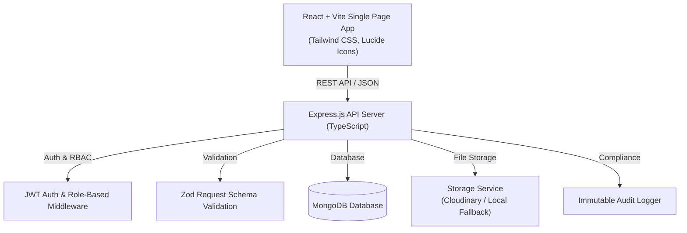

# 🏥 FollowUp (Health Platform)
### *Patient-Controlled Longitudinal Health Records & Consent-Driven Clinical Access Platform*

[](https://www.typescriptlang.org/)
[](https://react.dev/)
[](https://expressjs.com/)
[](https://www.mongodb.com/)
[](https://tailwindcss.com/)
[](https://vitejs.dev/)

---

## 🌟 The Problem
Modern electronic medical record (EMR) systems are fragmented and hospital-centric. When patients visit different clinics, specialists, or emergency rooms:
- Medical history is trapped in disconnected institutional silos or lost on paper.
- Patients lack ownership and visibility over who accesses their sensitive health data.
- Doctors make critical clinical decisions without full context of past allergies, medications, or diagnostic history.
- In medical emergencies, first responders lose precious minutes trying to discover life-critical conditions.

---

## 💡 The Solution: FollowUp
**FollowUp** flips the traditional EMR paradigm by placing **the patient at the center of their healthcare data**. Patients carry a lifetime longitudinal health passport (`PAT-XXXXXX`), while doctors gain permissioned, consent-backed access to provide coordinated, high-quality care.

### 🛡️ Core Pillars:
1. **Patient-Centric Ownership**: Patients own, manage, and view their complete medical timeline, allergies, active medications, and uploaded clinical files.
2. **Granular Consent & Access Control**: Doctors must explicitly request access with a stated clinical reason. Patients can approve, deny, or revoke access at any time.
3. **Emergency "Break-Glass" HUD**: In life-threatening emergencies, first responders can instantly access vital triage data (blood group, anaphylactic allergies, active medications, emergency contacts) with a permanent security audit record.
4. **Interactive Longitudinal Timeline**: Chronological, filterable visualization of a patient's lifetime consultations, prescriptions, checkups, and diagnostic reports.
5. **Physician Care Plans ("Health Paths")**: Doctors formulate structured recovery pathways allowing patients to track milestones, habits, and medications collaboratively.
6. **Immutable Audit Trail**: Every view, document access, consent grant, and emergency lookup is logged with timestamps, actor IDs, and clinical rationales.
7. **Collision-Free Identity Separation**: Strict namespace separation between Patients (`PAT-XXXXXX`) and verified Doctors (`DOC-XXXXXX`) to eliminate authorization vulnerabilities.

---

## 🏗️ Architecture & System Design



---

## 📂 Project Structure

```
├── client/                     # Frontend Application (React + Vite + Tailwind CSS)
│   ├── src/
│   │   ├── components/         # Reusable UI components & modals
│   │   │   ├── common/         # Navbar, Footer (with legal modals), ProtectedRoute, IdentityBadge
│   │   │   ├── doctor/         # Care plan modals, Consultation modals
│   │   │   └── patient/        # Allergy, Condition, Medication, Upload & Access modals
│   │   ├── context/            # AuthContext (JWT session state) & ToastContext
│   │   ├── pages/              # Role-specific dashboard & portal pages
│   │   │   ├── auth/           # Patient & Doctor Login/Register views
│   │   │   ├── doctor/         # Doctor Dashboard, Patient Lookup, Chart View, Health Paths, Emergency
│   │   │   ├── patient/        # Patient Dashboard, Records Vault, Timeline, Care Paths, Privacy Audit
│   │   │   ├── ContactPage.tsx # Reach Out To Us page (Direct helpline, Email, Address, Inquiry form)
│   │   │   ├── EmergencyPage.tsx # Emergency Break-Glass portal
│   │   │   ├── FAQPage.tsx     # Searchable 6 Healthcare FAQs & Accordions
│   │   │   ├── LandingPage.tsx # Homepage with live health card preview & on-page FAQs
│   │   │   └── TeamPage.tsx    # Team members & project builder details
│   │   ├── services/api.ts     # Centralized Axios HTTP client & API handlers
│   │   └── types/              # Frontend TypeScript interfaces
│   └── vite.config.ts          # Vite configuration with API proxy & allowed hosts
│
├── src/                        # Backend Application (Node.js + Express + TypeScript)
│   ├── config/                 # Database connection & Environment configuration
│   ├── controllers/            # Route controllers handling HTTP requests
│   │   ├── accessGrant.controller.ts  # Doctor access request & consent management
│   │   ├── audit.controller.ts        # Audit trail retrieval
│   │   ├── auth.controller.ts         # User registration & authentication
│   │   ├── doctor.controller.ts       # Clinical lookup & consultations
│   │   ├── emergency.controller.ts    # Break-glass emergency snapshot lookup
│   │   ├── healthPath.controller.ts   # Structured care pathways
│   │   ├── patient.controller.ts      # Profile, allergies, medications, conditions
│   │   ├── record.controller.ts       # Medical record upload & document downloads
│   │   └── timeline.controller.ts     # Longitudinal timeline aggregation
│   ├── middleware/             # Auth, role authorization, logging & error handlers
│   ├── models/                 # Mongoose schema models (User, Record, HealthPath, Audit, etc.)
│   ├── routes/                 # Express API route endpoints
│   ├── services/               # Business logic layer
│   ├── utils/                  # ID generators, Multer file uploaders, AppError class
│   └── validators/             # Zod input validation schemas
│
├── tests/                      # Automated End-to-End Test Suite
│   └── master_e2e.test.ts      # Full platform lifecycle E2E test
├── seed-demo.ts                # Comprehensive demo database seeder
└── package.json                # Project dependencies & scripts
```

---

## 🌐 Public Routes & Navigation

| Route | Description |
|---|---|
| `/` | Landing page with platform overview, interactive mockup demo, and FAQs |
| `/patient/login` | Patient authentication portal |
| `/patient/register` | Patient registration & `PAT-XXXXXX` ID generation |
| `/doctor/login` | Doctor clinical authentication portal |
| `/doctor/register` | Physician registration & `DOC-XXXXXX` ID verification |
| `/emergency` | Public Emergency HUD search for first responders |
| `/contact` | Reach out to us with direct helpline, email, and inquiry form |
| `/team` | Project team members, architecture, and roles |
| `/faq` | 6 interactive healthcare & consent FAQs with search filter |

---

## 🚀 Getting Started

### 1. Prerequisites
- **Node.js** (v18.0.0 or higher)
- **MongoDB** (Local instance or MongoDB Atlas URI)

### 2. Environment Setup
Create a `.env` file in the root directory (or copy from `.env.example`):
```env
PORT=5000
NODE_ENV=development
MONGODB_URI=mongodb://127.0.0.1:27017/async_health
JWT_SECRET=your_jwt_secret_key_here
JWT_EXPIRES_IN=7d
UPLOAD_STORAGE_TYPE=local
UPLOAD_DIR=./uploads
MAX_FILE_SIZE_MB=10
CORS_ORIGIN=*
```

### 3. Installation
```bash
# Install backend dependencies
npm install

# Install frontend dependencies
cd client
npm install
cd ..
```

### 4. Running Locally
Start both backend and frontend servers in development mode:

**Terminal 1 (Backend API):**
```bash
npm run dev
# Running at: http://localhost:5000
```

**Terminal 2 (Frontend Client):**
```bash
cd client
npm run dev
# Running at: http://localhost:5173
```

---

## 🧪 Testing & Seeding Demo Data

- **Run Automated E2E Test Suite:**
  ```bash
  npm test
  ```
- **Seed Demo Data (Sample Patients, Doctors, Records & Care Paths):**
  ```bash
  npx tsx seed-demo.ts
  ```

---

## 🔒 Security & Compliance Design
- **Password Hashing:** Passwords securely hashed with `bcryptjs` (salt rounds = 10).
- **Stateless Authentication:** JSON Web Tokens (JWT) with configurable expiration.
- **Role-Based Access Control (RBAC):** Strict separation between `PATIENT` and `DOCTOR` permissions.
- **Input Sanitization & Validation:** Comprehensive Zod schemas preventing injection and malformed payloads.
- **Audit Logging:** Every sensitive clinical access creates an unmodifiable `AuditLog` entry.
- **Interactive Legal Modals:** In-app accessible Privacy Policy, Terms of Service, HIPAA Compliance Statement, and Security Safeguards.

---

## 👥 Project Team & Contact
- **Project Founder & Lead Full-Stack Architect:** **Yash Mittal**
- **Email:** [`yashmittal1973@gmail.com`](mailto:yashmittal1973@gmail.com)
- **Phone:** `+91 93581 11009`
- **GitHub:** [`https://github.com/yashmittal646/medcord`](https://github.com/yashmittal646/medcord)

---
*Built with ❤️ for Hackathon 2026 — Empowering patients with sovereign healthcare data.*
